<p align="center">
  
</p>

<p align="center">
  <strong>Navigate ontologies, map tables, and chart your route to a knowledge graph.</strong><br>
  OntoCartographer Studio is a visual mapping tool for turning tabular data (CSV, TSV, Excel, JSON) into ontology-based knowledge graphs — and for re-modelling graphs you already have. Load any RDF/OWL ontology, drag its classes onto a canvas, connect them, drop your table columns onto the nodes, validate the mapping, and export the result as RDF, as a publication-ready image, or for visual exploration in the GraphExplorer. <br>
  No code, multilingual, and everything stays on your machine.
</p>

<p align="center">
  
  
  
  
  
  
  
</p>

---

## What is OntoCartographer Studio?

OntoCartographer Studio helps you turn tabular data — CSV, TSV, Excel or JSON — into a knowledge graph that follows an ontology of your choice. You draw the structure of your data as a graph: drag classes from the ontology onto a canvas, connect them with the properties the ontology allows, and drop your table columns onto them. The Studio then writes your data as RDF, ready for a triplestore, for publication, or for visual exploration in the GraphExplorer.

It also works the other way round: import an existing RDF graph or GraphExplorer JSON, and the Studio condenses it into its underlying model — one node per class, with the individual records kept in a table behind it — so you can re-model it and export it again.

It runs in your browser, on your own computer. It was originally developed for archaeological data modelled with CIDOC CRM and its extensions, but works with any RDF/OWL ontology.

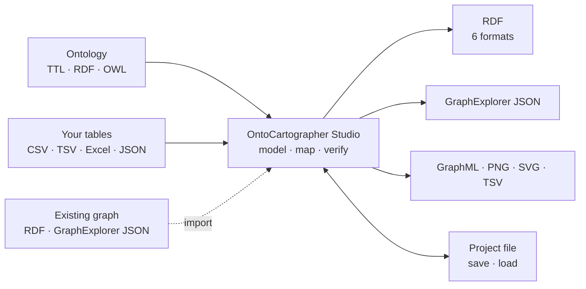
```mermaid
flowchart LR
    O["Ontology<br/>TTL · RDF · OWL"] --> S
    T["Your tables<br/>CSV · TSV · Excel · JSON"] --> S
    I["Existing graph<br/>RDF · GraphExplorer JSON"] -. import .-> S
    S["OntoCartographer Studio<br/>model · map · verify"] --> R["RDF<br/>6 formats"]
    S --> E["GraphExplorer JSON"]
    S --> V["GraphML · PNG · SVG · TSV"]
    S <--> P["Project file<br/>save · load"]
```

<details>
<summary><b>New to ontologies and knowledge graphs?</b></summary>

- **Ontology** — a shared vocabulary for a domain: which kinds of things exist (*classes*, e.g. "Site", "Excavation") and how they can be related (*properties*, e.g. "was investigated by"). CIDOC CRM is such an ontology for cultural heritage.
- **Knowledge graph** — your data expressed as statements of the form *subject – property – object*, e.g. "Site x – was investigated by – Excavation y". Each statement is called a *triple*.
- **RDF** — the standard file format for such statements. RDF files can be loaded into a *triplestore* (a graph database) and queried with SPARQL.

OntoCartographer Studio lets you produce these statements without writing them by hand: you model once which column becomes which class and how they connect, and the Studio writes one statement per row.

</details>

### Why OntoCartographer Studio?
 
- **No ontology expertise required** — search across all loaded ontologies at once, read every class and property definition where you need it, and let the tool offer the connections that are valid
- **Visual graph builder** — drag classes onto a canvas and draw the connections between them; what you see on screen is the mapping
- **No code, no mapping language** — no SPARQL, no scripts; you build the mapping by dragging
- **Works with any RDF/OWL ontology** — with built-in support for CIDOC CRM and its extensions
- **Full table mapping** — load your CSV, TSV, Excel or JSON files and drag their columns onto the graph to fill it with your data
- **Multilingual labels** — give every label in as many languages as your project needs
- **Import what you already have** — read RDF or a GraphExplorer JSON back onto the canvas, re-model it, export it again
- **Publication-ready exports** — RDF in six formats, plus GraphML (yEd), PNG, SVG, TSV, and JSON for the GraphExplorer
- **Everything stays on your machine** — runs locally in your browser (no account, no cloud, no external service)

<details>
<summary><b>See all features</b></summary>
 
**Modelling**
- **Visual graph builder** — Drag-and-drop ontology classes, draw property connections, build your mapping visually
- **CIDOC CRM colour convention** — Nodes are automatically coloured by their CRM superclass
- **Ontology-aware** — Loads TTL/RDF/OWL files, browses class hierarchies, suggests valid properties with domain/range inference including `owl:inverseOf`
- **Widening** — Optionally offer properties inherited from parent classes or defined on child classes
- **Custom classes and properties** — Use classes or property URIs that are not part of any loaded ontology (e.g. `xsd:date`, `geo:wktLiteral` or your own class)
- **Class replacement** — Change the class of a node after the fact; connections, column mappings, labels and position are kept
- **Dot-One properties** — Visual support for RDF-star annotations (e.g. typing a relationship: `<< SU1 AP11_has_physical_relation_to SU2 >> AP11.1_has_type "above"`)
- **Named Graphs** — Group nodes into named graphs (I4_Proposition_Set) with visual bounding boxes

**Data**
- **Table mapping** — Load CSV/TSV/XLSX (first sheet)/JSON files and drag column headers onto nodes: one ID column per node, optionally a label column
- **Keep your data current** — Reload a corrected table from its tab and every export carries the new state; when a project is opened, each table waits as a placeholder that recognises its file by name or columns
- **Project files** — Save and load your whole project as one JSON file
- **Join keys** — Separate domain and range key columns per connection, so one graph can draw on several tables
- **Multilingual labels** — Define the project's languages once; every node then offers a label slot per language, typed or from its own table column. Each language is exported with its correct `rdfs:label` tag

**Quality**
- **Graph verification** — Checks for missing mappings, ID/label swaps, orphan nodes, widening warnings, untranslated labels

**Large Graphs**
- **Collapse & fold** — Collapse nodes to their class name, or fold away the branch a node owns; display only, no export is affected

**Import & Export**
- **Graph import** — Reads RDF (Turtle, TriG, N-Triples, N-Quads, RDF/XML, N3, JSON-LD) and GraphExplorer JSON; all instances of a class arrive as one node with their data in a table behind it
- **Explorer names** — Custom display names for nodes and connections, used in the GraphExplorer JSON and leaving the RDF export untouched
- **Inverse control** — Name the opposite direction of a connection for the GraphExplorer, or switch it off per connection
- **Multi-format RDF export** — TriG, N-Quads, Turtle, N-Triples, RDF/XML, JSON-LD. Dot-One annotations are written as RDF-star in TriG, N-Quads, Turtle and N-Triples, and as standard `rdf:Statement` reification in RDF/XML and JSON-LD
- **GraphExplorer JSON export** — Exports the graph for the GraphExplorer, a companion tool for visual exploration; its first version is finished and will be published shortly
- **TSV export** — The two intermediate tables, URI and literal, with every prefix fully resolved
- **GraphML export** — yEd-compatible with colours, positions, and edge labels
- **Image export** — Publication-ready PNG (2× resolution) and scalable SVG
 
</details>

---

## Installation
 
### Prerequisites

To run OntoCartographer Studio you need Python (with pip) and Node.js (with npm):
 
- **Python 3.10+**: download from <https://www.python.org/downloads/>. Windows users: make sure to check **"Add Python to PATH"** during installation. Pip is included by default; if needed, install it separately: <https://pip.pypa.io/en/stable/installation/>
- **Node.js 18+** (includes npm): download from <https://nodejs.org/en/download/>
- A current web browser (Firefox, Chrome, Edge, Safari, ...). An internet connection is only needed for the setup; afterwards the Studio runs fully offline.

### Get the Project

Download the repository as a ZIP from GitHub (click **Code → Download ZIP** on the GitHub page) and unpack it, or clone it:

```bash
git clone https://github.com/oeai-dac/OntoCartographer-Studio.git
cd OntoCartographer-Studio
```

### Setup (only needed once)
 
Before using OntoCartographer Studio, a virtual environment with all required dependencies must be set up once:
 
- **Windows:** double-click **`setup.bat`**
- **Mac/Linux:** open a terminal in the project folder and run `bash setup.sh`
 
This creates a Python virtual environment and installs all needed dependencies and packages.
The first run downloads all dependencies and can take a few minutes with little visible output — let it finish. When it is done, the window shows **Setup complete!**.
 
### Start
 
To start the application:
 
- **Windows:** double-click **`start.bat`**
- **Mac/Linux:** open a terminal in the project folder and run `bash start.sh`
 
This automatically:

1. Starts the backend (FastAPI on port 8000)
2. Starts the frontend (Vite on port 3000)
3. **Windows:** opens your browser at <http://localhost:3000>. **Mac/Linux:** open that address yourself

**To stop:** on Windows, close the two windows titled *OntoCartographerStudio-Backend* and *-Frontend* (the launcher window can simply be closed too). On Mac/Linux, press `Ctrl+C` in the terminal — both processes are shut down together.


<details>
<summary><b>Manual Setup (alternative)</b></summary>
 
If you prefer to install and start OntoCartographer Studio manually (starting from your project folder):
 
```bash
# Backend
cd backend
python -m venv .venv         # Windows
# python3 -m venv .venv      # Linux/Mac
.venv\Scripts\activate       # Windows
# source .venv/bin/activate  # Linux/Mac
pip install -r requirements.txt
uvicorn main:app --reload --port 8000
 
# Frontend (separate terminal)
cd frontend
npm install
npm run dev
```
 
Then open **<http://localhost:3000>**.

While the backend runs, the interactive API documentation is available at **<http://localhost:8000/docs>**.
 
</details>

### Updating

Replace the project folder with the new version (or `git pull`), keep any project files you stored inside the folder, delete the folder `frontend/node_modules`, and run the setup again.

### Uninstall

Delete the project folder — nothing is installed outside it (apart from Python and Node.js themselves).
 
---

## Quick User Guide

New to this? The [Detailed User Guide](#detailed-user-guide) walks you through every step in full.  
Familiar with OntoCartographer Studio, RDF and ontology mapping? The short overview below is all you need.  
Want to see a finished mapping first? Load the [example data](#example-data).

<details>
<summary><b>Short overview for experienced users</b></summary>

### 1. Load One or More Ontologies

Upload one or more TTL/RDF/OWL ontology files. Classes, properties, domains/ranges (incl. `owl:inverseOf` and `owl:unionOf`) of all loaded ontologies are merged and searchable together.

### 2. Build Your Conceptual Graph

Use the **Triple Explorer** (side panel on the left) to browse the ontology:

- **① Subject** — Select a class (e.g. `E27_Site`)
- **② Predicate** — Pick a property (e.g. `AP3i_was_investigated_by`)
- **③ Object** — Choose the range class (e.g. `A9_Archaeological_Excavation`)

Toggle **↑ Parent / ↓ Child** widening to also offer properties inherited from superclasses or defined on subclasses.

Drag classes onto the canvas to create nodes. Connect them by drawing edges between handles, or let the tool auto-connect when you drop an object while a subject is selected.

Already have a graph? **Import** reads RDF (incl. RDF-star, TriG/N-Quads) or a GraphExplorer JSON onto the canvas instead —
one node per class, the instances in a table behind it — and you carry on from there.

### 3. Map Your Table Data

Switch to the **Table Panel**, load your CSV/TSV/XLSX (first sheet)/JSON file, and drag column headers onto nodes:

- **Upper drop zone** → Label column (display name)
- **Lower drop zone** → ID column (unique identifier)

Tick **Literal (no prefix)** for values that are not URIs. Connecting nodes from different tables? Set domain/range **join keys** by double-clicking the edge.

Multiple label languages: define them via the language button; each is exported as its own `rdfs:label` with a language tag (`"…"@de`, `"…"@en`).

### 4. Define Your Prefixes

Open the **Prefix Manager**. It offers the namespaces of the loaded ontologies, flags prefixes in your data that have no URI yet, and holds the Data ID Prefix — prepended to every value without a prefix of its own (define it in the list, too). Values may carry their own prefix (`geonames:6946280`).

### 5. Verify

Run **Verify** to catch missing mappings, possible ID/label swaps, orphan nodes, connections the ontology only allows with widening, cross-table edges without join keys and untranslated labels.
 
### 6. Export

Choose your export format:

**RDF** (TriG, N-Quads, Turtle, N-Triples, RDF/XML, JSON-LD — Dot-One as RDF-star where the format allows, named graphs in TriG/N-Quads/JSON-LD) · **GraphExplorer JSON** · **TSV** (URI + literal) · **GraphML** · **PNG** · **SVG**

### 7. Save Project

**Save** writes everything to one JSON file. On **Load**, each table returns as a placeholder — load the (updated) file into it and all mappings stay valid.

</details>

---

## Detailed User Guide

### Interface Overview
The toolbar runs along the top, the side panel on the left, the canvas fills the rest.

| | Element | Details |
|---|---|---|
| ① | Canvas | The main area where you build your graph by drag and drop |
| ② | Panel toggle | Switches between the Ontology Panel ③ and the Table Panel ④ |
| ③ | Ontology Panel | Load, browse and search ontologies |
| ④ | Table Panel | Load and map tables. The Table Panel ④ is shown as an inset; in the app, the toggle ② shows one panel at a time |
| ⑤ | [Label languages](#multilingual-labels) | Switches the display language of all nodes and defines the project's languages |
| ⑥ | [Prefix Manager](#8-prefix-manager) | Defines the URIs of all prefixes and the Data ID prefix for your data |
| ⑦ | [Node](#3-build-your-conceptual-graph) | Adds a node with a custom class that is not part of a loaded ontology (e.g. `xsd:date`, `geo:wktLiteral`) | 
| ⑧ | [Collapse / Expand](#collapse-nodes) | Folds every node down to its class name, or unfolds them all again |
| ⑨ | [Save / Load project](#12-save-and-load-projects) | Saves your current project as a `.json` file or loads a previously saved one |
| ⑩ | [Import](#6-import-an-existing-graph) | Reads an existing graph — RDF or GraphExplorer JSON — onto the canvas |
| ⑪ | [↑ Parent / ↓ Child](#widening-settings) | Widening: also offer properties from superclasses (Parent) or subclasses (Child) |
| ⑫ | [Verify graph](#9-verify) | Checks the graph for missing mappings, ID/label swaps, orphan nodes, untranslated labels and more |
| ⑬ | [Graphs](#named-graphs) | Groups nodes into named graphs (I4_Proposition_Set) with a coloured bounding box |
| ⑭ | [Export](#tsv-export) | TSV or GraphML, PNG, SVG  |
| ⑮ | [Export RDF](#rdf-export) | Choose an RDF format and export your data |
| ⑯ | [Explore](#graphexplorer-export) | Exports a JSON file for the GraphExplorer |

<p>
    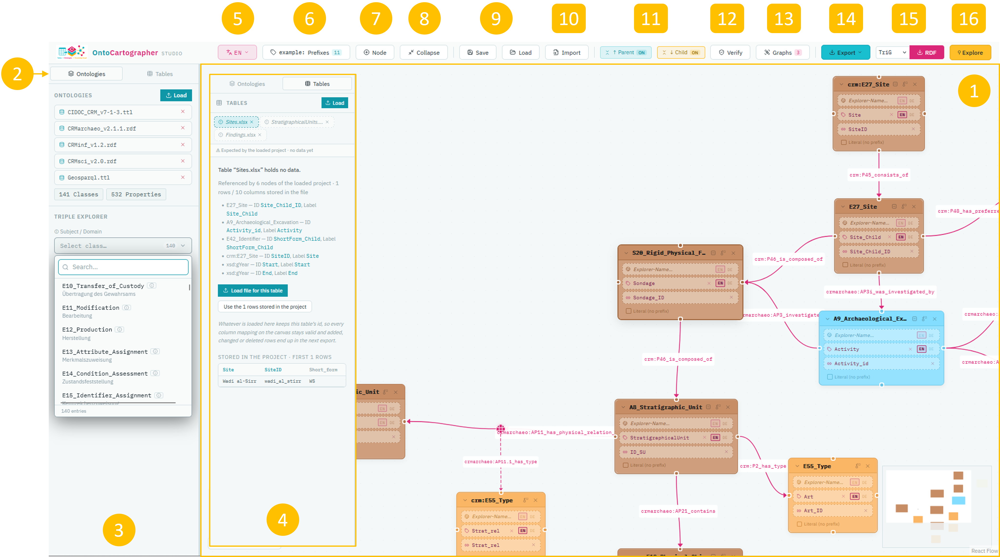
</p>

### Node Overview
Every class you place on the canvas becomes a node like this:

| | Element | What it does |
|---|---|---|
| ① | Class name | The ontology class of the node |
| ② | Collapse arrow | Folds the node down to its class name |
| ③ | ⊟ Fold | Hides the nodes that belong only to this node (appears only where there are any) |
| ④ | Replace | Changes the class; connections, columns and labels are kept |
| ⑤ | ✕ | Deletes the node |
| ⑥ | 🌐 Explorer name | Display name used only in the GraphExplorer |
| ⑦ | 🏷 Label | Drop the label column here, or type a fixed label. ✕ removes it |
| ⑧ | 🔗 ID | Drop the ID column here. ✕ removes it |
| ⑨ | Literal (no prefix) | Values are used as they are, without the Data ID prefix |
| ⑩ | Language chips | Only with more than one project language: switch the row's language; faded = still empty |
| ⑪ | Handles | Drag from one handle to another node to draw a connection |

<p>
    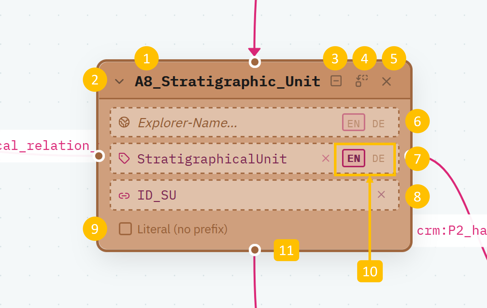
</p>


### 1. Load Ontologies

First, load the ontology — or ontologies — you want to model with. The Studio does not provide any; you need them as `.ttl`, `.rdf`, `.owl`, `.xml`, `.nt` or `.n3` files. 
For CIDOC CRM, download the RDFS file of the current version from [cidoc-crm.org](https://cidoc-crm.org/versions-of-the-cidoc-crm) or the official [GitLab repository](https://gitlab.isl.ics.forth.gr/cidoc-crm/cidoc_crm_rdf/-/tree/master); the extensions (CRMarchaeo, CRMsci, CRMinf, …) are available from their pages on [cidoc-crm.org](https://cidoc-crm.org/crm-harmonised-ontologies) or their official [GitLab repositories](https://gitlab.isl.ics.forth.gr/cidoc-crm/compatible-models).  
Other ontologies are usually published by their maintainers as OWL or RDF files.

> **Tip:** Load an extension together with the ontology it builds on (e.g. CRMarchaeo together with CIDOC CRM) — otherwise the class hierarchy is incomplete, and colours and widening cannot work as intended.

Make sure the Ontology Panel is showing — the toggle at the top ① switches between Ontologies and Tables — and click **Load** ②. You can select several files at once.

<p>
    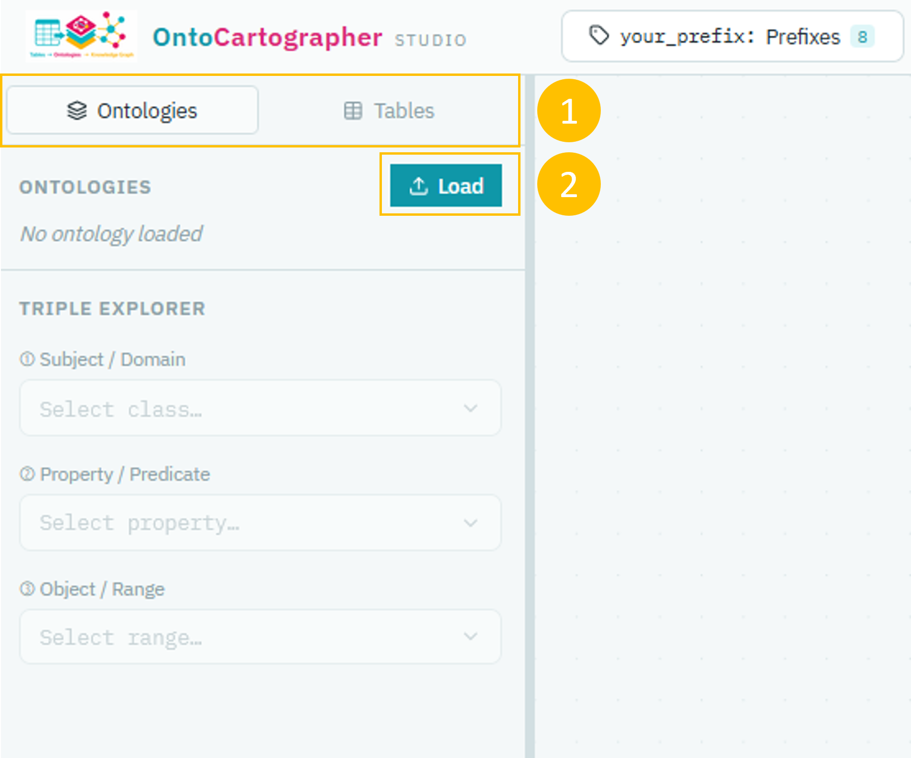
</p>

You can add more ontologies at any time or remove them by clicking ✕.

<p>
    
</p>

The counters below the list show how many classes and properties were parsed in total — a quick check that a newly added file actually contributed something. A file that cannot be read is reported in a message.

> **Note:** Ontologies are **not** stored in the project file. They stay loaded while the Studio is running (a browser reload keeps them), but after a restart you need to load them again — ideally before opening a saved project.

### 2. Explore the Ontologies: Search for Classes, Properties and Connections

The **Triple Explorer** in the Ontology Panel lets you browse all loaded ontologies as statements of three parts: a **Subject**, a **Property** and an **Object**.

> **Note:** Throughout this guide, *Subject* and *Domain* as well as *Object* and *Range* are used synonymously — the Triple Explorer reflects both RDF triple terminology and OWL property definitions.

**Choose a subject:** You can search through all loaded ontologies for specific classes: under **Subject / Domain**, click **Select class** ① and type a search term ② — it matches both class names and their labels. Below each class you
see its label from the ontology (in German where available, otherwise English). Click ℹ ③ to read the class definition. To select a class as subject/domain, simply click on it. The selected class appears as a card ④. It shows the class's superclasses (↑ `E18_Physical_Thing` › `E1_CRM_Entity` …); the branch icon at its top right also lists its subclasses.

<p>
    
    &nbsp;&nbsp;
    
</p>

**Choose a property:** The **Property / Predicate** list now offers every property
the subject can use, grouped as:

- **direct** — defined for this class in the ontology
- **inherited ↑** — defined for a superclass (shown with [Widening Parent](#widening-settings) switched on)
- **widened ↓** — defined for a subclass (shown with [Widening Child](#widening-settings) switched on)

The counter above the list tells you how many there are of each.

**Choose an object:** The **Object / Range** list offers the classes the property may point to, including their subclasses.

<p>
    
</p>

The **Triple Preview** at the bottom shows the complete statement. The subject and object cards marked *drag* are what you drag onto the canvas — see the next step.

#### Widening Settings
Two switches in the toolbar, **↑ Parent** and **↓ Child** ⑪, control which properties the Triple Explorer and the connection dialog offer for a class.

- **↑ Parent** (on by default) — also offers the properties a class inherits from its superclasses. This follows the ontology: a property defined for a superclass is valid for all its subclasses.
- **↓ Child** (off by default) — also offers properties that are only defined for a subclass. This goes beyond the ontology; [Verify](#9-verify) points out every connection that relies on it.

With both switched off, only properties defined directly for the class are offered.

**Example for Parent:** `P46_is_composed_of` is defined for `E18_Physical_Thing`, not for `E27_Site`. Since `E27_Site` is a subclass of `E18_Physical_Thing`, it inherits the property — with ↑ Parent on, connecting `E27_Site` via `P46_is_composed_of` to `S20_Rigid_Physical_Feature` is offered:
 
<p>
    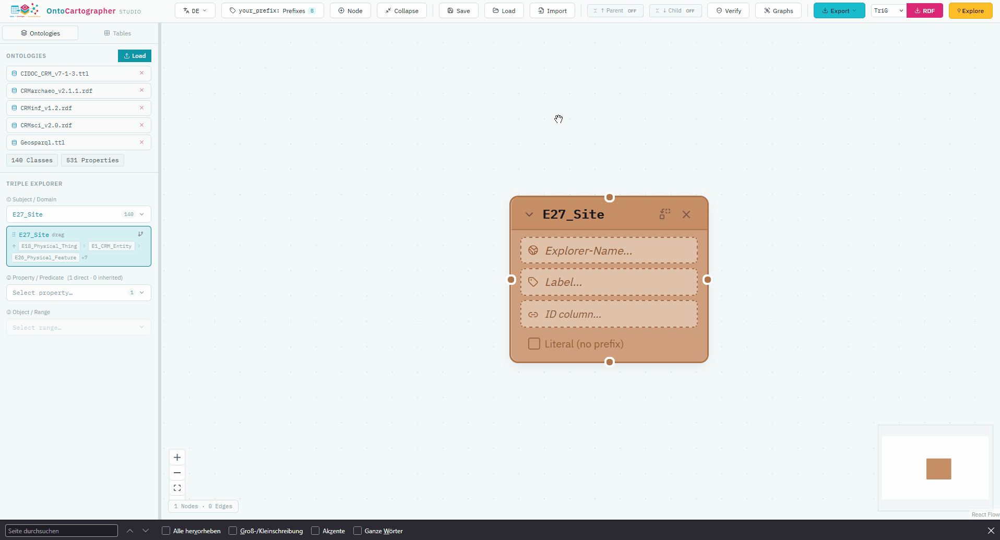
</p>

**Example for Child:** `AP19i_contains_embedding` is defined for `A2_Stratigraphic_Volume_Unit`, a subclass of `A8_Stratigraphic_Unit`. Strictly, an `A8_Stratigraphic_Unit` cannot use it — with ↓ Child on, the connection to `A7_Embedding` is offered anyway:
 
<p>
    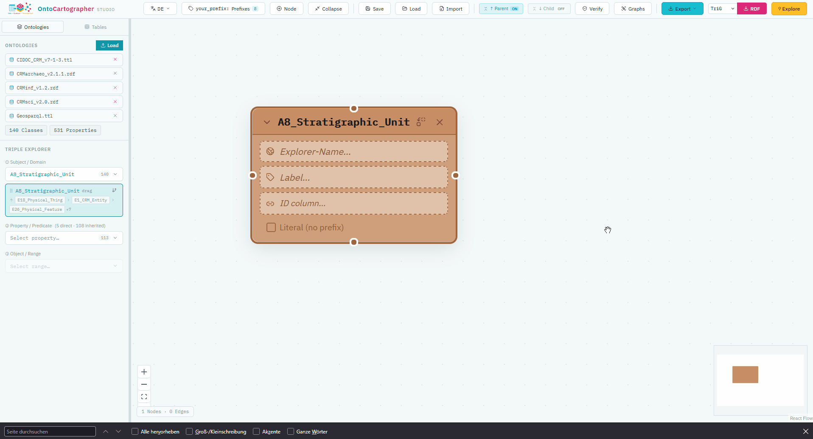
</p>

### 3. Build Your Conceptual Graph
Now you can start building your conceptual graph.

> Already have a graph? You can also [import an existing graph](#6-import-an-existing-graph) and continue working on it.

**Add nodes:** Drag the subject or object card from the Triple Explorer onto the canvas. Every class becomes a node; nodes of CIDOC CRM classes are coloured according to the CIDOC CRM colour convention (see [this discussion](https://cidoc-crm.org/Issue/ID-457-harmonization-of-graphical-documentation-about-crm) and [this document](https://cidoc-crm.org/sites/default/files/CIDOC%20CRM%20Diagram%20Guidelines.docx)). The same class can appear more than once — e.g. two `E55_Type` nodes for two different kinds of type.

<p>
    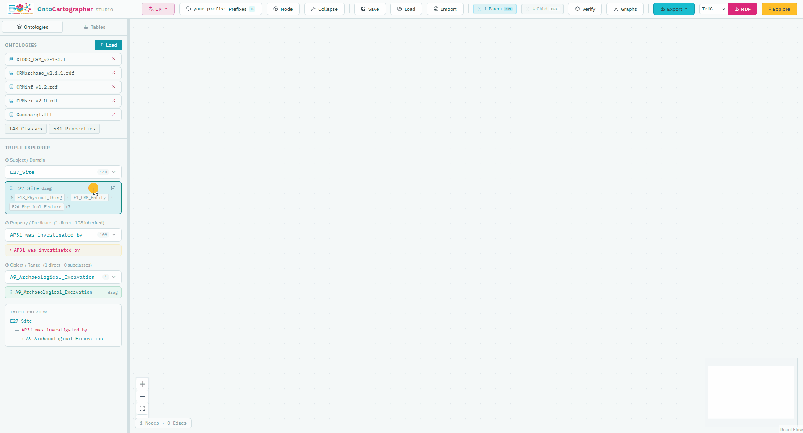
</p>

**Connect while adding:** Select a node on the canvas, then drag the object card onto the canvas: the new node is connected to the selected one with the property chosen in the Triple Explorer.
 
<p>
    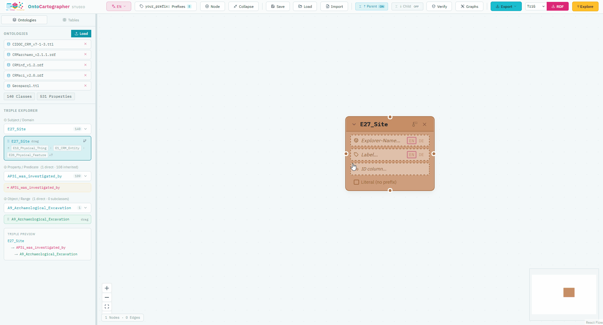
</p>

**Connect existing nodes:** Drag from a handle of one node to another node. A dialog offers all properties valid between the two classes — grouped into direct, inherited and widened as in the Triple Explorer (depending on your [widening settings](#widening-settings)) — and a free-text field for a property that is not part of the loaded ontologies.
 
<p>
    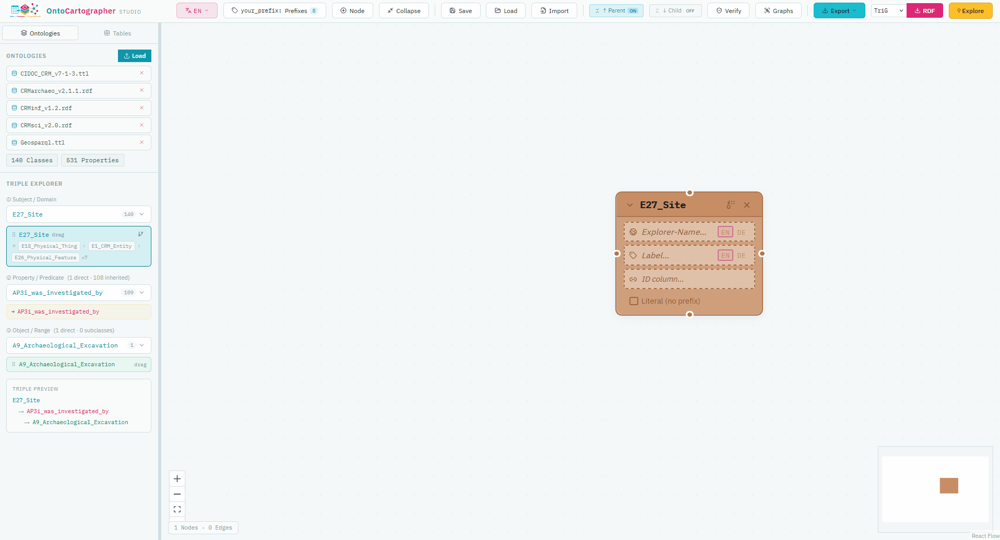
</p>
 
**Edit a connection:** Double-click it to change its property or its join keys (see [Map Your Data](#connect-data-from-several-tables)). To move where a connection leaves or enters a node, drag its end to another handle: 

<p>
    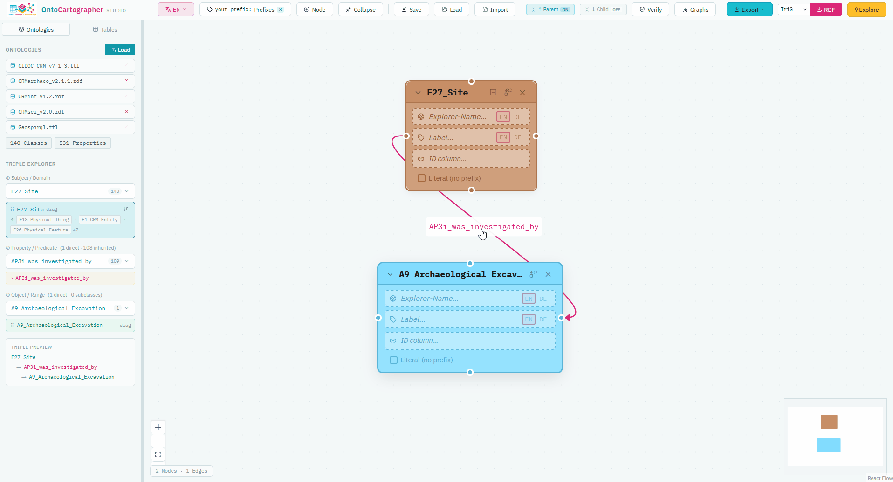
</p>
 
**Add a custom node:** For a class that is not part of the loaded ontologies — typically a data type such as `xsd:date` or `geo:wktLiteral` — click **Node** (⑦ in the [Interface Overview](#interface-overview)) in the toolbar, enter the class label and, optionally, its URI. For `xsd:` and `geo:` classes, *Literal (no prefix)* is switched on automatically. 

<p>
    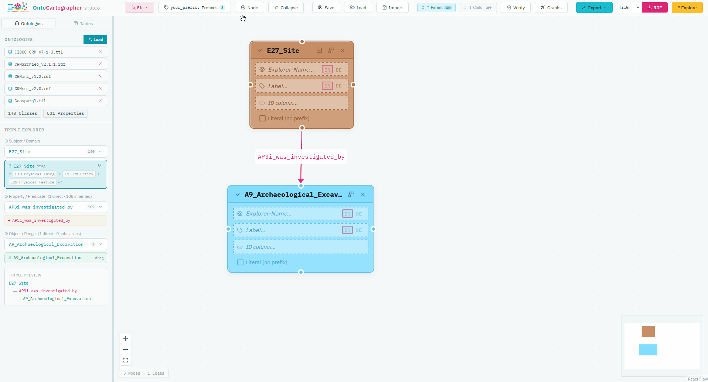
</p>

**Select and delete:** Shift + click or drag a frame to select several nodes. Delete a node with ✕ in its header, or select nodes or connections and press **Delete** (on a Mac: **fn + Delete**).

#### Change the Class of a Node

If you realise later that a node should carry a different class — for example `E18_Physical_Thing` should really be `E22_Human-Made_Object` — click the replace icon ④ in the node's header (see [Node Overview](#node-overview)). The dialog lists the classes of the loaded ontologies, grouped relative to the current class (subclasses first, then superclasses, then all others), and also accepts free input for classes outside them (e.g. `xsd:date`).

<p>
    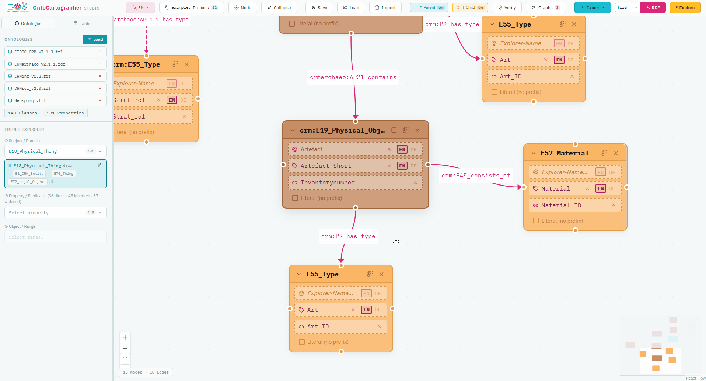
</p>

Only the class changes. Everything else stays as it is: connections, column mappings, labels, Explorer name, named graphs, position — and the *Literal (no prefix)* setting. If that setting no longer suits the new class, the dialog tells you.

If the ontology does not define one of the node's outgoing connections for the new class, the dialog says so before you confirm. The connections are kept anyway; run [Verify](#9-verify) afterwards to review them.

### 4. Map Your Data onto the Conceptual Graph
So far the graph describes the *structure* of your data. Mapping fills it: you assign table columns to the nodes, and every row of a table becomes one instance of each node mapped to it.

#### Load Tables

Switch to the **Table Panel** ① and click **Load** ②. Supported are `.csv`, `.tsv`, `.xls`, `.xlsx` (first sheet only) and `.json`; you can select several files at once. Each table opens in its own tab, showing its first 10 rows ③.

For a JSON file, a dialog asks how to read it: as **Records** (a list of entries, one row each — typical for database or API exports) or as **Schema / Form** (nested field definitions, one row per field).
 
<p>
    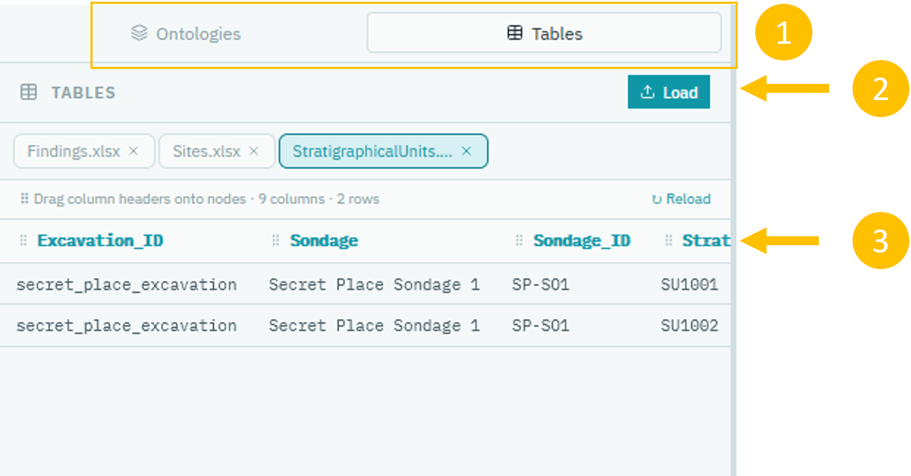
</p>

**Updated a table?** Correct it outside the Studio and load it again with **↻ Reload** in its tab — every mapping stays in place and all exports use the new rows. See [Save and Load Projects](#tables-after-loading) for how tables come back when you reopen a project.

#### Assign Columns to Nodes

Drag a column header onto a node:

- **lower half** → **ID** column: identifies each instance. Its values should be unique and contain no spaces.
- **upper half** → **Label** column (optional): the readable name of each instance.

Instead of a label column you can also type a fixed label. A node with only a typed label and no column stands for **one** instance shared by all rows — useful e.g. for a type that applies to every record.

<p>
    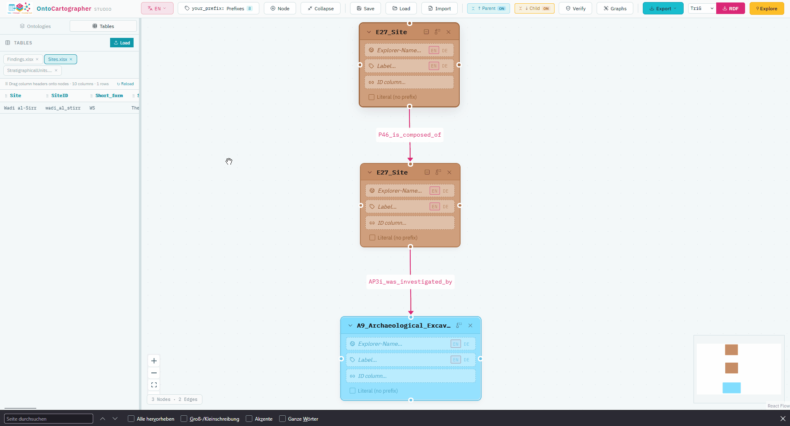
</p>

You can define one general prefix (= Data ID prefix) for your data. IDs don't need to carry this prefix: the **Data ID prefix** you set in the [Prefix Manager](#8-prefix-manager) is added automatically.  
If a value in your data needs a prefix different from the ontology prefixes or the Data ID prefix, indicate it directly in the cell using the format `prefix:value` (e.g. `geonames:6946280`).
 
If a node contains literal values (dates, measurements, free text) — meaning that no prefix should be added automatically — you can activate the **Literal (no prefix)** option on the respective node. If the checkbox is unchecked ①, the Data ID prefix will be added to these values. If the box is checked ②, no prefix will be added and the value is used as it is:
 
<p>
    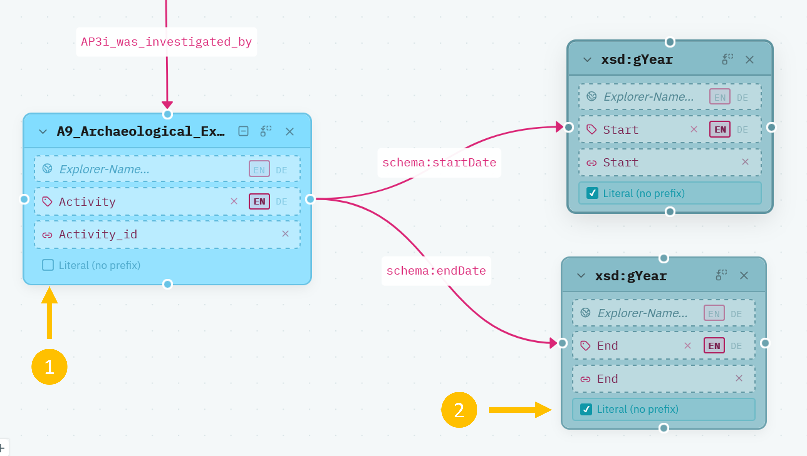
</p>

#### Connect Data from Several Tables

If two connected nodes are mapped to the **same table**, their instances are connected row by row — nothing else to do. If they come from **different tables**, tell the Studio which rows belong together: double-click the connection (or use the dialog when drawing it) and choose

- **Join Source** — a column of the source node's table, and
- **Join Target** — a column of the target node's table.

Rows are connected wherever the two columns hold the same value — e.g. `Activity_id` in the site table and `Excavation_ID` in the stratigraphical unit table.

> **Tip:** Always set join keys explicitly. Without them the Studio tries to guess a suitable column, which may not be the one you mean; [Verify](#9-verify) reports every cross-table connection that has none.

<p>
    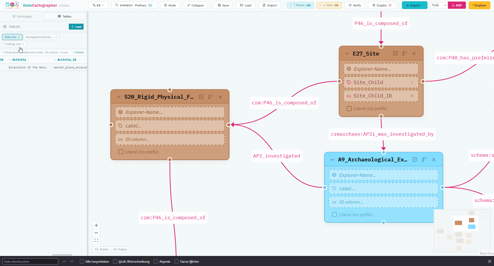
</p>

#### Multilingual Labels

Labels can be given in several languages. The languages belong to the **project**, not to the individual node — you define them once and every node then offers exactly those slots. With a single language, nothing of this appears.

**Define the languages:** The language button (⑤ in the [Interface Overview](#interface-overview)) shows the current display language (e.g. **EN**). Click it to see all languages of the project: the ✓ marks the one currently shown, *primary* marks the primary language — the one everything falls back to.

If you click on **Manage languages** you can add ① or delete ② languages or make one the primary language ③. Nothing changes until you click **Save** — and if a change would move or delete labels, the dialog tells you first. 

<p>
    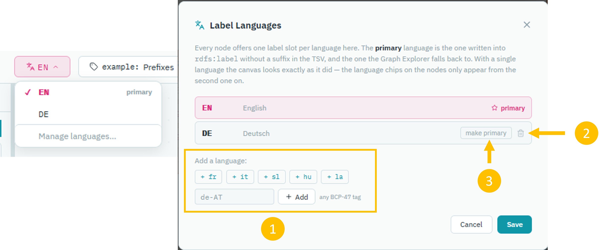
</p>

**On the node:** With two or more languages, the 🌐 Explorer name and 🏷 Label rows show a small strip of language chips:

| Chip | Meaning |
|---|---|
| outlined, pink | active — the language the row shows and edits |
| bold, solid | this language has a value |
| thin, faded | this language is still **empty** |

Click a chip to switch that row. Typing and dropping a column both go into the language the row is showing — so for a table with `Art` and `Art_DE`, switch the row to *en* and drop the first column, then switch it to *de* and drop the second column. The ID stays the same in every language: an instance has one identity, however many names it has.

<p>
    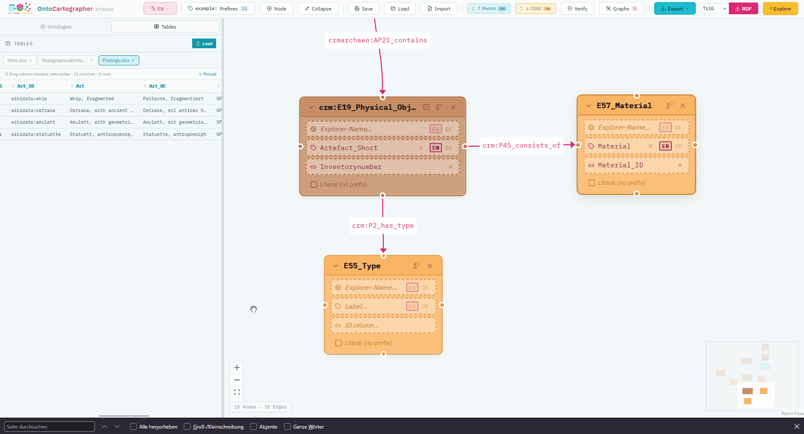
</p>

To switch every node at once, choose a language in the menu of the language button.

<p>
    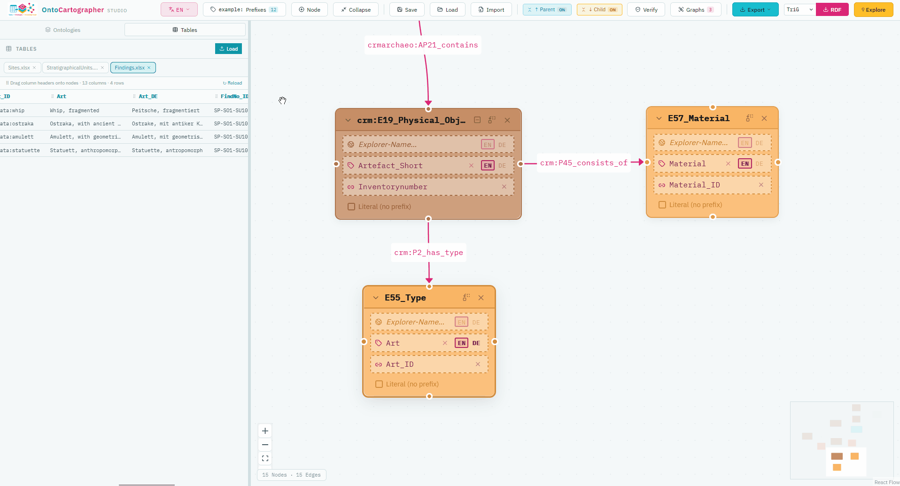
</p>

**Finding the gaps:** [Verify](#9-verify) reports, per language, how many nodes still lack a label or an Explorer name.

**In the export:** every language becomes its own `rdfs:label` with the right language tag (`"Grubenverfüllung"@de`, `"Pit fill"@en`).

<details>
<summary><b>Details: TSV, GraphExplorer JSON and limitations</b></summary>

- **TSV:** four additional columns per additional language (`domain_label@en`, …), after all existing columns
- **GraphExplorer JSON:** per-language labels in `l_i18n` and `typeLabelsI18n`/`edgeLabelsI18n`; the GraphExplorer currently shows the primary language
- **Single-language:** Explorer names of connections, the GraphML export, and graph import (one label per resource is read)

</details>

> **If you are opening a project saved before version 3.1.0:** up to 3.0.0 the RDF export wrote every label as `@en`, hard-coded, whatever language the text was actually in. Such a project now loads with the current primary language and tells you so. If that language is not the right one for it, change it with the language button — the existing text moves to the correct slot rather than being relabelled.

### 5. Advanced Modelling

Two features go beyond simple statements: **Dot-One properties** make a statement about a connection itself, **named graphs** group statements together. Both are optional — skip this section if your data does not need them.

#### Dot-One Properties (RDF-star)

Sometimes a connection itself needs a description — for example, the *type* of a stratigraphic relation:

> *"SU1002 has a physical relation to SU1001, and that relation is of type 'below'"*

CIDOC CRM models this with so-called **Dot-One properties** (named after their numbering, e.g. `AP11.1_has_type` belongs to `AP11_has_physical_relation_to`); in RDF they are written as **RDF-star**.

To add one, drag a class card from the Triple Explorer — e.g. `E55_Type` — directly onto the connection (or select the connection first and drop the card on the canvas). A dialog asks for the Dot-One property. Since these properties are usually not part of the ontology files, you will mostly type it into the free-text field, e.g. `crmarchaeo:AP11.1_has_type`.
 
The connection then gets a small midpoint, linked by a dashed line to a new node for the class you dropped. That node works like any other: drop a column onto it, and every row gets its own value — e.g. *above* or *below* from a `Strat_rel` column.

<p>
    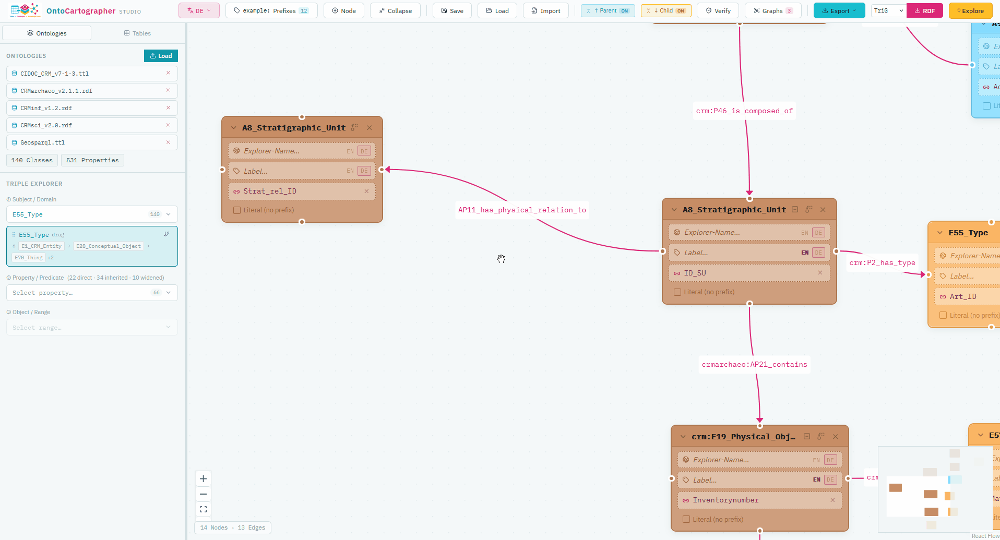
</p>

In the RDF export, Dot-One properties are written as RDF-star in TriG, N-Quads, Turtle and N-Triples, and as `rdf:Statement` reification in RDF/XML and JSON-LD.

#### Named Graphs
 
A named graph groups statements under a name of their own — for example, to keep apart what comes from different sources or interpretations (in CIDOC CRM's CRMinf: an `I4_Proposition_Set`).

1. Select the nodes on the canvas (Shift + click or drag a frame).
2. Click **Graphs** (⑬ in the [Interface Overview](#interface-overview)).
3. Enter a name and click **Selection → Graph**.

The name becomes the **URI of the graph**, so give it as a prefixed name such as `example:Excavation1989` (the prefix must be defined in the [Prefix Manager](#8-prefix-manager)). All connections leaving a node of the group are written into that graph. A node can belong to one named graph only.

Click a graph in the list to highlight its nodes with a coloured frame and zoom to them; ↻ replaces its nodes with the current selection, the bin deletes it.
 
<p>
    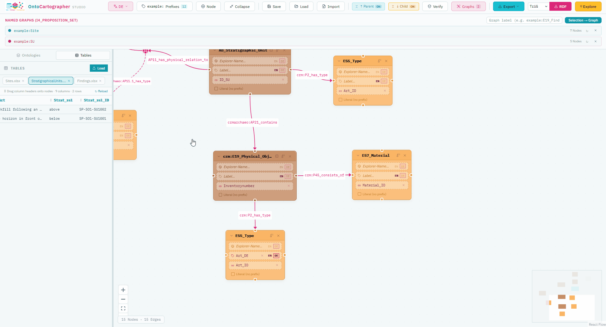
</p>
 
> **Note:** Named graphs are kept in the **TriG**, **N-Quads** and **JSON-LD** export. In all other formats, every statement ends up in one single graph.

### 6. Import an Existing Graph

Already have a knowledge graph? Instead of building one from scratch, you can import it and continue working on it — re-model it, add data, export it again. Everything described in the following chapters applies to imported graphs as well.

Click **Import** (⑩ in the [Interface Overview](#interface-overview)) and choose an RDF file (`.ttl`, `.trig`, `.nt`, `.nq`, `.n3`, `.rdf`, `.owl`, `.xml`, `.jsonld`) or a GraphExplorer JSON (`.json`).

The Studio condenses the graph into its underlying model: all instances of the same class become **one** node, and the instances themselves are kept in a table behind it. A graph with 4,000 instances therefore arrives as roughly a dozen nodes. The tables appear in the Table Panel like uploaded spreadsheets.

<p>
    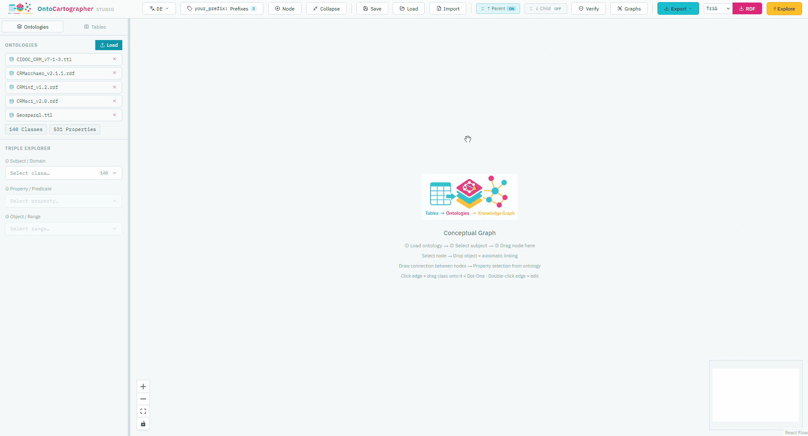
</p>

Before anything reaches the canvas, a **preview** shows the classes with their number of instances, the connections between them, and any warnings. Confirm with **Import**: the graph is *added* to the current canvas, arranged so that connections run left to right.

> **Tip:** Load the ontology first if you have it. It is not required, but it lets the Studio pick the most specific class for resources with several types and show readable names. To import into an empty canvas, reload the page — the loaded ontologies stay.

**After the import**, the nodes behave like any other: [change their class](#change-the-class-of-a-node), re-draw connections, drop further columns onto them. Then run [Verify](#9-verify).

Worth knowing:

- **Dot-One:** RDF-star annotations (`<< … >>`) in an RDF file come back as [Dot-One properties](#dot-one-properties-rdf-star). From a GraphExplorer JSON they arrive as plain connections — import the RDF if you need them.
- **Prefixes:** instances that already have full URIs are imported with *Literal (no prefix)* switched on, so no Data ID prefix is added. IDs that are not URIs (as a GraphExplorer JSON may use) do get it.
- **Missing URIs:** classes or properties without a URI are imported as custom classes and listed in the preview. Give them a proper class or property URI before exporting RDF — otherwise those statements are skipped.
- **Project files** are not imported: open them with **Load**.

<details>
<summary><b>What is not carried over</b></summary>

A round trip is not identical to the original. For re-modelling and re-exporting this does not matter; for an archival copy it does.

- **Named graphs:** TriG and N-Quads files are read completely, but graph membership is not restored — the preview tells you how many graphs were merged
- **Blank nodes** are skipped
- **Resources without `rdf:type`** are collected under `rdfs:Resource`
- **RDF-star annotation syntax** `{| … |}` is not read (only `<< … >>`)
- **Labels:** one label per resource is read; multilingual labels do not fill the language slots
- **Several annotation properties on one relation:** the most frequent one is used

</details>

### 7. Working with Large Graphs

Imported graphs and detailed mappings quickly fill the canvas. Three tools keep them readable — all of them change only what you **see**: every node, mapping and connection stays in the project and in every export.

#### Navigate the Canvas

Zoom with the mouse wheel or the **+ / −** buttons at the bottom left; **⛶** fits the whole graph into view. The minimap at the bottom right shows where you are, and the counter at the bottom tells you how many nodes and connections the graph has.

#### Collapse Nodes

Click the arrow ② in a node's header (see [Node Overview](#node-overview)) to fold it down to its class name, or use **Collapse** (⑧ in the [Interface Overview](#interface-overview)) to fold all nodes at once — the button then turns into **Expand**.

A collapsed node shows small icons for what is set on it: a globe for an Explorer name, a tag for a label, a link for an ID column. With several project languages, the globe and tag are dimmed until every language is filled in.

<p>
    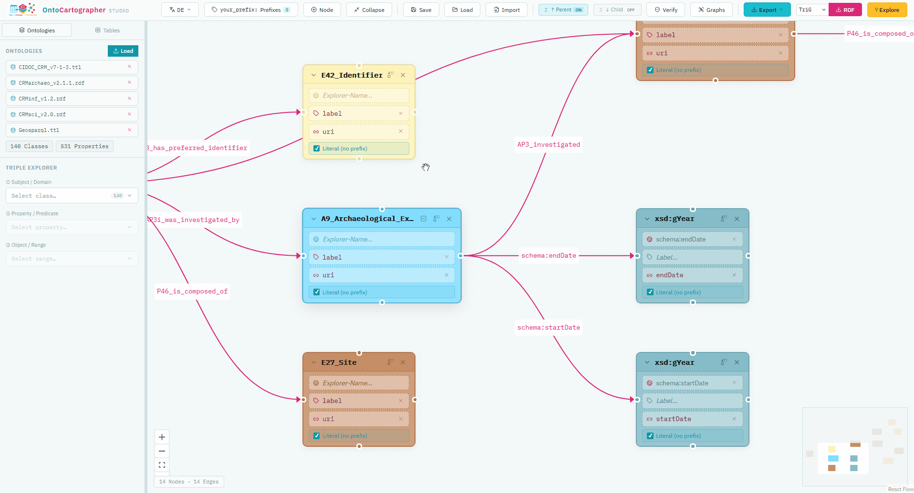
</p>

#### Fold Away the Nodes Below a Node

The **⊟** button ③ in a node's header hides the nodes that hang off it — typically values, identifiers and Dot-One nodes. It then shows how many nodes are hidden; click it again to bring them back.

Only nodes that belong **exclusively** to this node are hidden — including whole chains below it. A node that is also connected to another part of the graph stays visible, so nothing disappears from a place you did not click. That is also why the button only appears on nodes that actually have such nodes.

<p>
    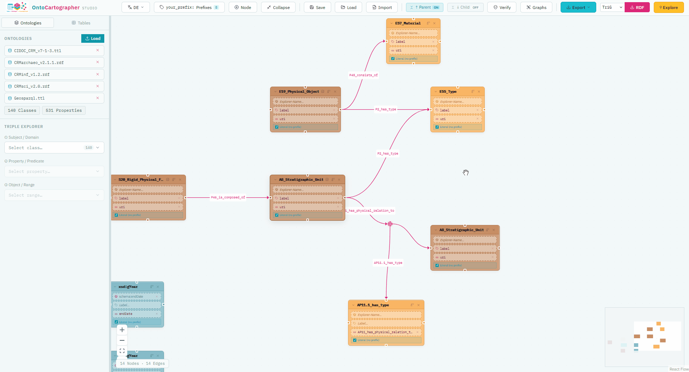
</p>

The collapsed and hidden state is saved with the project.
 

### 8. Prefix Manager

RDF identifies everything by a web address (URI) — it does not have to lead to an actual web page. To keep them readable, URIs are abbreviated with **prefixes**: the prefix `crm` means `http://www.cidoc-crm.org/cidoc-crm/`. So `crm:E27_Site` stands for `http://www.cidoc-crm.org/cidoc-crm/E27_Site`.

For the export, every prefix used in your graph or your data must be defined. Therefore it is recommended to open the Prefix Manager right before exporting, as by then all prefixes in your data should be present. The **Prefix Manager** checks your data and manages all prefixes. 

Open the **Namespace Prefix Manager** with the **Prefixes** button (⑥ in the [Interface Overview](#interface-overview)). It has four parts:

1. **Data ID Prefix** — the prefix added to every ID in your data that has none of its own, e.g. `example` → `example:SU1001`. Set it at the beginning of a project, and make sure the same prefix is also defined in the list below — otherwise your IDs cannot be turned into URIs. The default `your_prefix` is a placeholder.
2. **Prefixes detected from the loaded ontologies** — click one to add it to the list (✓ = already there).
3. **Prefixes found in your tables or nodes without a definition** (⚠) — values such as `geonames:6946280` use a prefix that is not defined yet. Click it to prefill the input below, add its URI and click **Add**.
4. **The list of all prefixes** — eight common ones (`crm`, `crmarchaeo`, `crmsci`, `lrmoo`, `rdf`, `rdfs`, `owl`, `xsd`) are there from the start. Edit or delete entries directly, and add new ones at the bottom.

Changes take effect when you click **Save**; the prefixes are stored with the project.
 
<p>
    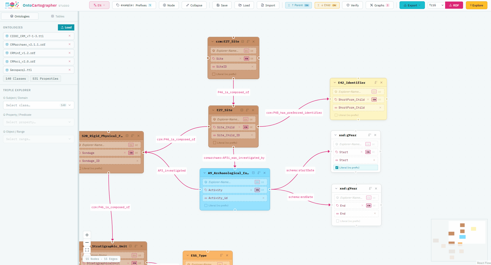
</p>

### 9. Verify
 
Click **Verify** (⑫ in the [Interface Overview](#interface-overview)) to check your graph and its mapping at any time. Verify does not change anything — it lists what may need your attention, below the toolbar, in three levels: ● **errors**, ▲ **warnings** and ○ **hints**. Close the list with ✕.
 
<p>
    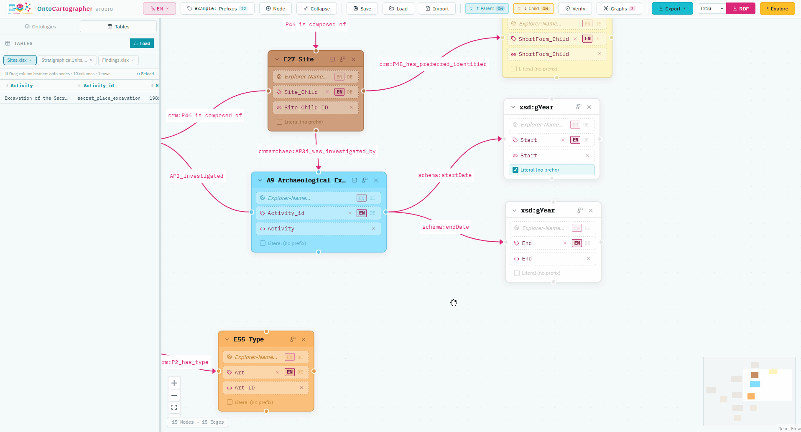
</p>

| | What is checked |
|---|---|
| ● | A connection uses a property the ontology does not define for this class |
| ▲ | A node has neither an ID column nor a label |
| ▲ | ID and label column may be swapped — the ID contains spaces, or the label looks like a URI |
| ▲ | A connection is only valid with [Widening Child](#widening-settings) |
| ○ | A node has an ID column but no label |
| ○ | A node is not connected to anything |
| ○ | A connection between two tables has no [join keys](#connect-data-from-several-tables) |
| ○ | Per additional [language](#multilingual-labels): nodes still without a label or Explorer name |

> **Note:** Verify needs the ontologies to be loaded — otherwise every connection is reported as unknown. Undefined prefixes are not part of Verify; the [Prefix Manager](#8-prefix-manager) flags them.

### 10. Settings for the GraphExplorer

The **GraphExplorer** is a companion application for exploring your data visually — a searchable graph with filters, maps, charts, a timeline and a stratigraphy view. It is available [here](https://github.com/oeai-dac/GraphExplorer). OntoCartographer Studio exports a file for it with **Explore** (see [GraphExplorer Export](#graphexplorer-export)).

That file is built from the same mapping as the RDF, with a few differences that make it easier to read: labels and free-text values (`rdfs:Literal`, `xsd:*`, `geo:wktLiteral`) become attributes of their node instead of nodes of their own. Two settings let you adapt the result further. Neither of them changes your RDF export.

#### Explorer Names

In the GraphExplorer, a node appears under its class and a connection under its property — `E22_Human-Made_Object`, `P45_consists_of`. For readers who do not work with CIDOC CRM every day, you can give both a name of your own:

- **Node:** type the name into the 🌐 *Explorer-Name…* row (⑥ in the [Node Overview](#node-overview)) and press Enter; ✕ removes it again.
- **Connection:** double-click it and fill in **Explorer-Name (Property)**; **Clear** removes it again.

The name also decides how things are **grouped** in the GraphExplorer: nodes of the same class with *different* names become *separate* groups. One `E55_Type` can thus appear as "Material", "Relation type" and "SU category" — while the RDF keeps `E55_Type` throughout. The same applies to connections: edges that share a property *and* a name form one group; give the same property different names and it splits into that many groups. Dot-One relations keep their own labels.

The GraphExplorer also shows every connection from the other side — `P45_consists_of` also as `P45i_is_incorporated_in`, as declared by `owl:inverseOf` in the ontology. You can name this opposite direction yourself in the same dialog with **Inverse Explorer-Name (Property)** — where the ontology declares no inverse (e.g. for a custom property), or where you prefer a different name. If the opposite reading would
be wrong, uncertain or you simply do not want it, tick **No automatic opposite direction for this connection**: only the direction you modelled is shown.

Both are disabled for connections to free-text values, since those become attributes and have no other side.

>**Tip:** Avoid `/` and `#` in these names — only the text after them is shown.

<p>
    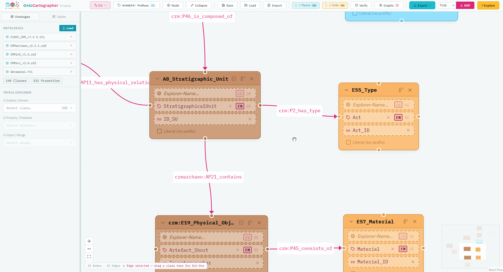
</p>

With several [project languages](#multilingual-labels), node Explorer names can be given per language (properties will come in a future release).

**None of this reaches your RDF.** The names are read by the GraphExplorer JSON export alone — the TriG, Turtle and RDF/XML output is identical whether a name is set or not.

### 11. Export

The three buttons on the right of the toolbar give you several export possibilities (see [Interface Overview](#interface-overview)):

| | Button | Exports |
|---|---|---|
| ⑭ | **Export ▾** | the graph as GraphML, PNG or SVG — or the data as TSV |
| ⑮ | format + **RDF** | your data as RDF, in the format chosen next to the button |
| ⑯ | **Explore** | a file for the GraphExplorer |

Every export uses the rows of the tables **currently loaded** in the Table Panel. A table that is not loaded is taken from the project file, and the message after the export names it.

#### RDF Export

Choose a format next to the **RDF** button and click it. A message tells you how many statements (triples) were written. If it reports none, a prefix is usually missing — check the [Prefix Manager](#8-prefix-manager).

| Format | File | Named graphs | Dot-One |
|---|---|---|---|
| TriG | `.trig` | ✓ | RDF-star |
| N-Quads | `.nq` | ✓ | RDF-star |
| JSON-LD | `.jsonld` | ✓ | `rdf:Statement` |
| Turtle | `.ttl` | merged into one graph | RDF-star |
| N-Triples | `.nt` | merged into one graph | RDF-star |
| RDF/XML | `.rdf` | merged into one graph | `rdf:Statement` |

Labels are written once per [project language](#multilingual-labels), each with its language tag. The file is called `ontology-export` plus the format's extension.

#### GraphExplorer Export

Click **Explore**. The Studio creates `graph-explorer-data.json`; open it in the [GraphExplorer](https://github.com/oeai-dac/GraphExplorer) by dragging it into the window. What this file contains and how to adjust it is described in [Settings for the GraphExplorer](#10-settings-for-the-graphexplorer).

#### TSV Export

**TSV (URI + Literal)** in the **Export ▾** menu downloads the two tables the RDF and GraphExplorer exports are built from: `Triples_URI.tsv` (all connections between resources) and `Triples_URI_literal.tsv` (all values). Every URI is written out in full, so the files can be used with any other RDF tool.

<details>
<summary><b>Column layout of the TSV files</b></summary>

The first eleven columns follow the format Gerald Hiebel designed for the former RDF Pipeline (see [Acknowledgments](#acknowledgments-and-credits)):

`id_of_domain_uri` · `class_of_domain_uri` · `domain_label` · `p3_has_note` · `property_uri` · `id_of_the_range_uri` · `class_of_the_range_uri` · `range_label` · `dot_one_uri` · `dot_one_target_uri` · `i4_uri`

In `Triples_URI_literal.tsv`, `p3_has_note` comes after `dot_one_target_uri`.

Both files continue with the settings for the GraphExplorer:

`no_inverse` · `domain_explorer_label` · `range_explorer_label` · `property_explorer_label` · `inverse_property_uri`

With several [project languages](#multilingual-labels), four columns follow per additional language, e.g. for English: `domain_label@en` · `range_label@en` · `domain_explorer_label@en` · `range_explorer_label@en`. The plain `domain_label` etc. hold the primary language.

</details>

#### Images and GraphML

From the **Export ▾** menu:

- **PNG** — an image of the whole graph at 2× resolution, e.g. for publications
- **SVG** — a scalable vector image
- **GraphML** — the graph with colours, positions and labels, to open and rearrange in [yEd](https://www.yworks.com/products/yed)

Images show the graph exactly as it is displayed — collapsed nodes collapsed, hidden nodes hidden, labels in the current display language.

> **Tip:** For a compact figure, [collapse the nodes](#collapse-nodes) before exporting the image.

 
### 12. Save and Load Projects

**Save** (⑨ in the [Interface Overview](#interface-overview)) downloads your whole project as one file, `ontocartographer-project.json` — to your browser's download folder. It contains:
- all nodes and connections with their classes, properties, column mappings, labels, Explorer names, join keys and Dot-One properties
- the **rows of your tables** — so the project works even without the original files (large tables make the file large)
- named graphs, prefixes and the Data ID prefix, project languages, widening settings, and which nodes are collapsed or hidden

**Not** included are the ontologies: [load them](#1-load-ontologies) before opening a project.

**Load** opens a saved project and **replaces** what is currently on the canvas (unlike [Import](#6-import-an-existing-graph), which adds to it). Project files from older versions open as well — see the note on projects saved [before version 3.1.0](#multilingual-labels).

#### Tables After Loading

A project is usually reopened to work with **updated** data. That is why the tables do not simply reappear: the Table Panel shows one **placeholder** per table instead (dashed tab, marked Expected by the loaded project). It names the nodes and columns waiting for it and shows the first rows stored in the project, so you can recognise the table. Fill it in one of these ways:

- **Load the table file** with the panel's **Load** button ① — it finds its placeholder by file name or by its columns.
- **Load it from the placeholder's own tab** ② — the file takes that place, whatever it is called.
- **Use the rows stored in the project** ③ — one click, if they are still up to date.
- **Choose a table that is already loaded** ④ from the dropdown in the tab.

<p>
    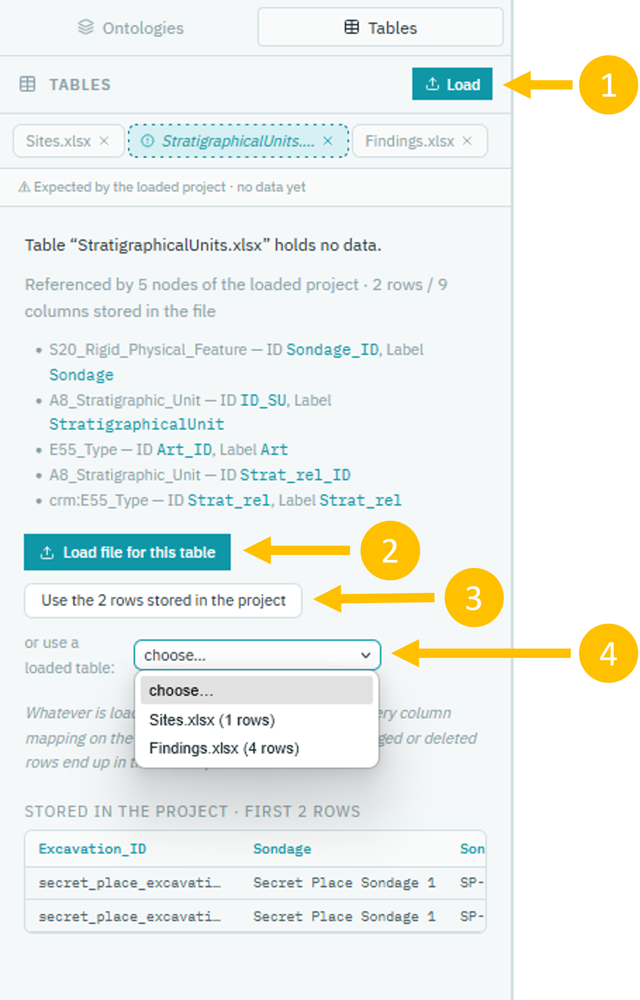
</p>

Every column mapping stays valid whichever way you choose.

**Saving always writes the current data:** the rows of the tables loaded at that moment. To update a project — new, changed or deleted records — edit the table outside the Studio, load it again (or use [↻ Reload](#load-tables)), and save. Tables that are not loaded are written from the rows already stored in the project.

<details>
<summary><b>How a table finds its placeholder</b></summary>

- **By file name** — for projects saved with version 2.1.0 or later.
- **By columns** — otherwise: the same header set, or all mapped columns plus at least half of the others. Added or deleted rows, or a column more or less, do not break the match.
- **Only if the match is unique.** If a file fits two placeholders equally well (typically an old and a new version of the same table), it binds to neither — load it from the right placeholder's tab instead.
- A project can list **more tables than you ever loaded**: an older version of a table may still be referenced by some nodes. Point that placeholder at the loaded table with the dropdown.

</details>

---
 
## Example Data

The folder `0_exampleData/` contains a small archaeological example — sites, stratigraphic units and finds — mapped onto CIDOC CRM. It is a quick way to see a finished mapping before building your own.

1. [Load the ontologies](#1-load-ontologies) the example uses: CIDOC CRM (v7.1.3), CRMarchaeo (v2.1.1) and CRMsci (v2.0).
2. Open `modelling/OntoCartographer-Studio_Example.json` with **Load** in the toolbar. The mapping appears on the canvas; the Table Panel shows three placeholders.
3. In the Table Panel, click **Load** and select `Sites.xlsx`, `StratigraphicalUnits.xlsx` and `Findings.xlsx` together — each file finds its placeholder by name.
4. Explore, change, [verify](#9-verify) and [export](#11-export) it like your own project.

| File | Content |
|---|---|
| `Sites.xlsx`, `StratigraphicalUnits.xlsx`, `Findings.xlsx` | The three example tables |
| `prefixes.txt` | Common prefixes with their URIs — to copy into the [Prefix Manager](#8-prefix-manager) for your own projects (the example project already contains them) |
| `modelling/OntoCartographer-Studio_Example.json` | The example project |
| `modelling/RDF_Export.trig` | Its RDF export (TriG) |
| `modelling/Triples_URI.tsv`, `modelling/Triples_URI_literal.tsv` | Its TSV export |
| `modelling/GraphExplorer_Export.json` | Its export for the GraphExplorer |
 
---

## CIDOC CRM Support

OntoCartographer Studio works with any RDF/OWL ontology, but a few features are made for CIDOC CRM and its extensions (CRMarchaeo, CRMsci, CRMinf, …):

- **Colour convention** — nodes are coloured by the CIDOC CRM class they belong to, following the [CIDOC CRM diagram guidelines](https://cidoc-crm.org/sites/default/files/CIDOC%20CRM%20Diagram%20Guidelines.docx). Nodes of other ontologies stay neutral.
- **Dot-One properties** — CIDOC CRM's way of describing a connection itself, written as RDF-star (see [Dot-One Properties](#dot-one-properties-rdf-star)).
- **Named graphs as `I4_Proposition_Set`** — see [Named Graphs](#named-graphs).
- **Labels** — where an ontology offers several languages, its German `rdfs:label` is shown first, then the English one. This applies to every ontology, not only CIDOC CRM.

<details>
<summary><b>The colours</b></summary>

A node takes the colour of the first of these classes found among its superclasses:

| Colour | Class | e.g. |
|---|---|---|
| brown | `E18_Physical_Thing` | objects, buildings, finds |
| light blue | `E2_Temporal_Entity` | events, activities |
| pink | `E39_Actor` | persons, groups |
| pale yellow | `E41_Appellation` | names, identifiers |
| blue-grey | `E52_Time-Span` | time-spans |
| green | `E53_Place` | places |
| grey | `E54_Dimension` | dimensions |
| orange | `E55_Type` | types (also `E56_Language`, `E57_Material`, `E58_Measurement_Unit`) |
| yellow | `E28_Conceptual_Object` | concepts, documents |
| purple | `E92_Spacetime_Volume` | spacetime volumes |
| light grey | `E59_Primitive_Value` | values |

</details>

---
 
## Troubleshooting

### Installation and Start

**"python is not recognized" (Windows) / "python3 not found" (Mac/Linux)**  
Python is not installed or not in your PATH. On Windows, reinstall Python and check **"Add Python to PATH"**, or add it to your PATH manually.

**"npm is not recognized" / "node not found"**  
Node.js is not installed or not in your PATH. Install Node.js 18+ from <https://nodejs.org/en/download/> and open a new terminal.

**Port 8000 or 3000 already in use**  
Close the application that uses the port, or change the port:
- **Backend:** the `--port` argument in `start.bat` / `start.sh` — and the proxy `target` in `frontend/vite.config.js`, so the frontend still finds the backend.
- **Frontend:** `port` in `frontend/vite.config.js` — on Windows also the address `start.bat` opens in the browser.

**The page is blank or nothing reacts**  
Check that the backend is running: <http://localhost:8000/health> should show `"status": "ok"`. If not, restart the Studio.

**Something behaves oddly after an update**  
Delete the folder `frontend/node_modules` and run the setup again (see [Updating](#updating)).

### Working with the Studio

**An ontology does not appear in the list**  
It could not be read — a message names the file. Check that it is valid RDF in one of the supported formats (`.ttl`, `.rdf`, `.owl`, `.xml`, `.nt`, `.n3`), e.g. with an RDF validator.

**A property I expect is not offered**  
Check the [widening settings](#widening-settings): the property may be defined only for a subclass (↓ Child). If it is not part of the loaded ontologies at all, enter it in the free-text field of the connection dialog.

**Verify reports every connection as an error**  
The ontologies are not loaded — after a restart, [load them again](#1-load-ontologies).

**The tables are empty after loading a project**  
That is intended: each table waits as a placeholder for its (updated) file — see [Tables After Loading](#tables-after-loading).

**A table file does not go into its placeholder**  
It matches more than one placeholder, or none clearly. Load it from the placeholder's own tab instead.

**"Invalid project format" (Load) / "This is a Studio project file" (Import)**  
Load and Import are mixed up: **Load** opens project files, **Import** reads RDF and GraphExplorer JSON.

### Export

**"No triples written" / URIs skipped in the RDF export**  
A prefix is not defined. Open the [Prefix Manager](#8-prefix-manager): prefixes found in your data without a definition are marked with ⚠ — and make sure your Data ID prefix is defined too.

**The SVG does not open in Illustrator or Inkscape**  
Known limitation: the SVG embeds the nodes as HTML, which only browsers display. Use the PNG for now; an editable SVG is planned.

---
 
## License
 
GPL 3.0

---

## AI Assistance

OntoCartographer Studio was developed with the AI coding assistant [Claude Code](https://claude.com/claude-code) by Anthropic. Claude was used to write and refactor code, to review it against the documentation, and to help with drafting the documentation. The concept, the modelling decisions, the requirements and the testing come from the author; every change was reviewed before it was adopted.

---
 
## Acknowledgments and Credits
 
**RDF Pipeline** (Ontotext Refine → GraphDB) incl. all its scripts, part of OntoCartographer Studio up to version 2.1.0:
*Gerald Hiebel, University of Innsbruck, Institute of Archaeology and Digital Science Centre*
<Gerald.Hiebel@uibk.ac.at> · [University page](https://www.uibk.ac.at/archaeologien/institut/mitarbeiter/gerald-hiebel/gerald_hiebel.html) · [ORCID: 0000-0002-3799-8391](https://orcid.org/0000-0002-3799-8391)
 
Developed for digital archaeology and cultural heritage data management. The CIDOC CRM colour scheme follows established conventions in the CRM community.